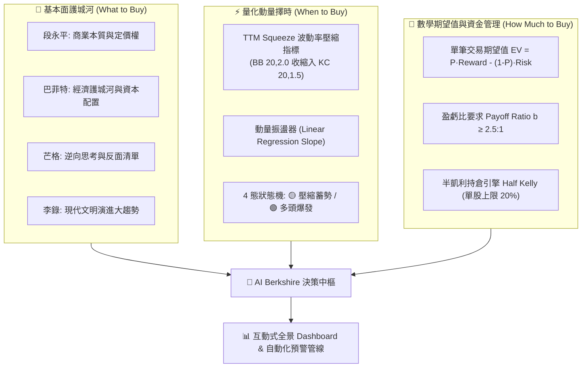

# AI Berkshire — 深度價值投資與量化決策操作系統 (美股 & 台股)

> "Price is what you pay, value is what you get." — Warren Buffett  
> "反過來想，總是反過來想。" — Charlie Munger  
> **用 AI 重新定義投研深度，以數學與紀律駕馭市場波動。**

[](https://wenlee2025.github.io/ai-berkshire/)
[](tests/)
[](tools/)
[](.agents/)
[](docs/adr/)

**AI Berkshire** 是一套同時相容 **Google Antigravity**、**Claude Code** 與 **OpenAI Codex** 的現代化價值投資與量化決策操作系統。將巴菲特、芒格、段永平、李錄四位價值投資大師的方法論深度系統化，並融合 **TTM Squeeze 波動率壓縮動量策略**、**單筆交易數學期望值 (EV)** 與 **半凱利公式 (Half Kelly Sizing)** 資金管理模型，深耕**美股 (US Equities)** 與**台股 (Taiwan Equities)** 核心市場。

🌐 **線上公開儀表板 (支援手機 & 電腦 24/7 查閱)**：[https://wenlee2025.github.io/ai-berkshire/](https://wenlee2025.github.io/ai-berkshire/)

**一個人 + AI Agent = 一個配備頂級基本面護城河、量化動量擇時與數學倉位管制的機構級投研團隊。**

---

## 🌟 核心能力亮點



### 1. 👑 四大家深度投研體系 (4 Masters Integrated Framework)
- **段永平視角**：穿透財報數字，直擊商業本質，檢驗企業是否在「做對的事情」並享有核心產品定價權。
- **巴菲特視角**：嚴格計算經濟護城河深淺、自由現金流創造力與管理層資本配置紀律。
- **芒格視角**：徹底逆向思考，制定不買清單、競爭殺手威脅與反脆弱極限壓力測試。
- **李錄視角**：錨定人類現代化與科技進化大趨勢，尋求 10~20 年長期複合增長確定性。

### 2. ⚡ TTM Squeeze + 數學期望值 (EV) + 半凱利公式 (Half Kelly Sizing)
- **擇時催化 (When to Buy)**：以 John Carter 經典 TTM Squeeze 監控布林帶（20, 2.0 SD）是否收縮進肯特納通道（20, 1.5 ATR），捕捉低波動極致壓縮後的爆發性突破拐點。
- **數學期望值 (EV)**：結合基本面確定性勝率 \( P_{win} \) 與技術面 ATR 停損，確保每筆進場具備實質正期望值（\( EV > 0 \)）且盈虧比 \( b \ge 2.5:1 \)。
- **半凱利持倉引擎 (How Much to Buy)**：採用機構級 Half Kelly（\( \frac{1}{2} f^* \)），結合單檔 20% 硬性上限與單筆最大 2% 淨值風控，徹底杜絕情緒化重倉與毀滅性回撤。

### 3. 📊 互動式全景投研 Dashboard
- **37 檔全景監控**：涵蓋台積電、川湖、華邦電、奇鋐、緯穎、信驊等 37 檔核心供應鏈標的，一秒切換。
- **⚡ TTM & 凱利實盤計算器**：輸入總資產與目標價，即時試算最佳配置資金、建議買進股數與單筆最大承受虧損。
- **⚔️ 同業橫向對比矩陣 (Peer Comparison)**：散熱模組 (奇鋐 vs 健策)、AI 伺服器代工 (鴻海 vs 廣達 vs 緯穎)、CCL (台光電 vs 聯茂 vs 台燿)、載板 (欣興 vs 景碩 vs 臻鼎) 關鍵指標一鍵對比。
- **💼 投資組合模擬配置器 (Portfolio Simulator)**：動態拉動持股權重滑桿，即時試算組合加權預期 ROE、前瞻 P/E、殖利率與護城河評分。
- **📑 Markdown 報告導出**：支援一鍵複製與下載標準化深度研究報告。

### 4. 🛡️ 數據雙源交叉驗證 (Dual-Source Cross-Validation) 與精確手算市值
- **零 LLM 幻覺**：核心財務指標（營收、毛利率、營益率、EPS、ROE、FCF）必須通過至少兩個獨立信源（美股：SEC EDGAR / Macrotrends；台股：FinMind / MOPS）比對，誤差率 > 1% 立即警示。
- **精確市值算術手算**：強制以「最新股價 × 最新實際流通股數」計算，嚴禁 ADR 存託比率混淆（如 1 TSM ADR = 5 股 2330）。

### 5. ⚡ 本地 SQLite 快取層 (`data/berkshire.db`) 與自動化監控
- 內建零外部依賴的本地 SQLite 快取層，行情、月營收與 5 年財報毫秒級載入，避免 API 頻率限制。
- `tools/pipeline_watcher.py` 自動監控 37 檔標的之月營收異動與投資論文漂移，生成結構化預警報告。

---

## 🚀 快速開始 (Quick Start)

### 1. 安裝與環境準備
```bash
# 複製儲存庫
git clone https://github.com/wenlee2025/ai-berkshire.git
cd ai-berkshire

# 安裝 Python 依賴
pip install -r requirements.txt
```

### 2. 啟動視覺化投研 Dashboard
```bash
# 啟動本地多執行緒 Dashboard 伺服器
python ai_berkshire.py dashboard --port 8080
```
👉 在瀏覽器中打開 **[http://localhost:8080](http://localhost:8080)**（亦支援離線直接雙擊 `dashboard/index.html` 開啟）。

### 3. 統一 CLI 命令操作
```bash
# 執行單股四大家深度研究
python ai_berkshire.py research 2344.TW

# 執行財報精讀與月營收分析
python ai_berkshire.py review 2317.TW 2026Q2

# 執行全市場選股篩選
python ai_berkshire.py screen --market tw

# 掃描 37 檔標的月營收異動與論文漂移預警
python ai_berkshire.py watch

# 執行單股 TTM Squeeze、期望值與凱利持倉量化試算
python tools/ttm_squeeze_kelly.py --entry 177.0 --stop 162.0 --target 220.0 --winrate 0.65 --capital 1000000

# 驗證市值與財務算術
python tools/financial_rigor.py verify-market-cap --price 177.0 --shares 4500000000 --reported 796500000000

# 執行全量單元測試 (38 項測試)
python -m unittest discover tests
```

---

## 🤖 三大 AI 代理全生態支援 (Agent Support)

本專案支援市面上主流的頂級 AI 代理，實現同一套方法論在不同開發環境中無縫調用：

| AI 代理 | 指令入口 | 規範設定檔 | 技能目錄 |
|---|---|---|---|
| **Google Antigravity** | `/investment-research`, `/earnings-review`, `/quality-screen` 等 | `GEMINI.md` | `.agents/skills/` |
| **Claude Code** | `/investment-research`, `/thesis-tracker`, `/financial-data` 等 | `CLAUDE.md` | `skills/` |
| **OpenAI Codex** | `/investment-research`, `/portfolio-review`, `/industry-funnel` 等 | `AGENTS.md` | `codex-skills/`, `codex-prompts/` |

> 修改 `skills/*.md` 標準源碼後，執行 `python scripts/sync-antigravity-skills.py && python scripts/sync-codex-skills.py && python scripts/sync-codex-prompts.py` 即可一鍵自動同步至所有 Agent 技能目錄！

---

## 📐 架構決策紀錄 (Architectural Decision Records)

本專案的所有重大技術選型與金融模型演進均完整記錄於 [docs/adr/](docs/adr/)：

- [ADR 0001: 美股與台股雙核心市場聚焦與信源架構](docs/adr/0001-us-tw-market-focus.md)
- [ADR 0002: 雙源交叉驗證與手算市值規範](docs/adr/0002-dual-source-rigor.md)
- [ADR 0003: SQLite 數據快取層與統一 CLI 系統架構](docs/adr/0003-data-cache-and-unified-cli-architecture.md)
- [ADR 0004: TTM Squeeze 策略、數學期望值與半凱利持倉決策架構](docs/adr/0004-ttm-squeeze-expected-value-kelly-sizing.md)
- [ADR 0005: 深度模組架構與統一市場數據引擎](docs/adr/0005-deep-module-unified-market-data-engine.md)
- [ADR 0006: 專注美股與台股雙市場架構與非核心市場清理](docs/adr/0006-exclusive-us-tw-market-focus-and-cny-purge.md)
- [ADR 0007: GitHub Pages 雲端對外部署、行動端響應式適配與每日自動更新管線](docs/adr/0007-github-pages-deployment-and-mobile-ux.md)

---

## 📂 專案目錄結構

```text
ai-berkshire/
├── .github/workflows/            # GitHub Actions CI/CD 自動化管線
│   ├── deploy-pages.yml          # 自動構建並發布至 GitHub Pages
│   └── daily-update.yml          # 每日盤後自動拉取數據、計算並部署
├── ai_berkshire.py               # 統一根 CLI 分發器
├── CONTEXT.md                    # 領域模型、術語與指標規範
├── GEMINI.md                     # Google Antigravity 代理規範
├── CLAUDE.md                     # Claude Code 代理規範
├── AGENTS.md                     # OpenAI Codex 代理規範
├── skills/                       # 核心 Skill 定義標準來源 (20 個投研技能)
├── .agents/skills/               # Antigravity 技能封裝
├── codex-skills/                 # Codex 技能封裝
├── codex-prompts/                # Codex 快捷 Slash 提示詞
├── dashboard/                    # 視覺化投研 Web 應用程式 (支援手機 & 電腦)
│   ├── index.html                # Dashboard 結構 (8 大功能模組 & 多欄雙向排序)
│   ├── style.css                 # 現代深色金融終端設計樣式 (全響應式 Mobile UX)
│   ├── app.js                    # 前端互動、TTM Squeeze 與凱利計算引擎
│   ├── stocks_data.js            # 37 檔全量離線同步數據庫
│   └── stocks_db.json            # 完整 JSON 數據集
├── tools/                        # 財務數據工具與驗算引擎
│   ├── market_data_engine.py     # 統一市場數據引擎 (Deep Module Pattern)
│   ├── ttm_squeeze_kelly.py      # TTM Squeeze、期望值與凱利持倉引擎
│   ├── data_cache.py             # SQLite 零依賴快取層 (data/berkshire.db)
│   ├── pipeline_watcher.py       # 月營收異動與論文漂移自動預警
│   ├── dashboard_server.py       # 多執行緒無快取 HTTP 伺服器
│   ├── financial_rigor.py        # 市值手算與雙源交叉驗證
│   ├── stock_screener.py         # 台股/美股選股掃描器
│   ├── twstock_data.py           # 台股 FinMind & MOPS 數據接口
│   └── usstock_data.py           # 美股 Yahoo/SEC/Macrotrends 數據接口
├── docs/adr/                     # 架構決策紀錄 (ADR 0001~0007)
├── tests/                        # 完整單元測試套件 (45 個測試 100% 通過)
└── reports/                      # 歷史深度投研報告與警報庫
```

---

## ⚠️ 免責聲明 (Disclaimer)

本專案所包含之數據、分析模型、程式碼與報告**僅供學習、學術探討與投資研究參考，不構成任何形式的個人化投資建議或買賣推薦**。市場有風險，投資需謹慎。投資人應基於獨立思考與自身風險承受能力做出最終決策。

---

## 📄 開源授權 (License)

本專案採用 [MIT License](LICENSE) 開源授權。
